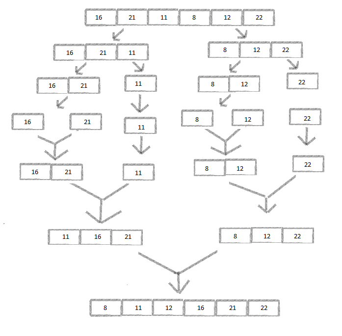

### Merge-Sort
Merge Sort (Birleştirme Sıralaması), diziyi ardışık olarak en küçük alt dizilerine kadar yarılayan sonra da onları sıraya koyarak bireştiren özyineli bir algoritmadır. Yarılama işlemi en büyük alt dizi en çok iki öğeli olana kadar sürer. Sonra "Merge (Birleştirme)" işlemiyle altdiziler ikişer ikişer bölünüş sırasıyla sıralı olarak bir üst dizide bireşir. Süreç sonunda en üstte sıralı diziye ulaşılır.

# [16,21,11,8,12,22] -> Merge Sort

### Soru 1) Yukarıdaki dizinin sort türüne göre aşamalarını yazınız.
> 

### Soru 2) Big-O gösterimini yazınız.
> Merge Sort'un Big-O gösterimi O(n log n) olarak ifade edilir. Bunun nedeni algoritmanın "böl ve fethet" yaklaşımıdır.

>1. Bölme aşaması: Algoritma, giriş dizisini daha küçük parçalara böler. Her bir bölme işlemi, dizinin boyutunu yarıya indirir. Bu nedenle, bu bölme işlemi logaritmik zaman karmaşıklığına (log n) sahip olacaktır. Çünkü, genel olarak, bir şeyi sürekli olarak yarıya böldüğümüzde, bunu logaritmik sayıda kez yapabiliriz.

>2. Birleştirme aşaması: Daha sonra, bu küçük parçalar, sıralanmış bir dizi oluşturmak üzere birleştirilir. Her bir birleştirme işlemi, en kötü durumda, her elemanın bir kez karşılaştırılmasını gerektirir, bu da birleştirme işleminin lineer zaman karmaşıklığına (n) sahip olacağı anlamına gelir.

>Bu iki aşamanın birleşimi, Merge Sort'un O(n log n) zaman karmaşıklığına sahip olmasını sağlar. Çünkü her bölme adımında (log n), her eleman üzerinde bir işlem gerçekleştiriyoruz (n).
